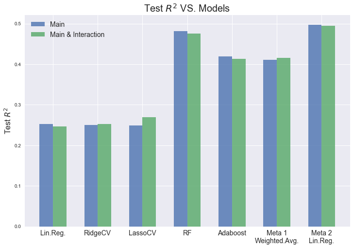

## Contents
{:.no_toc}
*  
{: toc}


Here, we explore different regression models to predict the number of followers (log-scale) of each playlist. We use 2 sets of features and fitted 2 sets of regression models respectively.

- Feature set 1: **main predictors only**
- Feature set 2: **main predictors and interaction terms of (genre X numerical_audio_feature_avg)**

For each set of features, do the following 2 steps:
- Use main predictors only and fit **single** regression models:
    - Linear Regression
    - (Perform PCA on the main predictors and interaction terms set of features)
    - RidgeCV
    - LassoCV
    - Random Forest Regressor
    - Adaboost Regressor

- **Stack** all fitted models on the training set together to fit a
    - **Meta regressor 1: Weighted Average** 
        - Gather the predicted values of all the fitted single models on the validation set
        - Average each single model's predicted value weighted by its accuracy on the same validation set
    
    - **Meta regressor 2: Meta Linear Regressor** 
        - Gather the predicted values of all the fitted single models on the validation set
        - Fit a linear regression model on these single models' predicted values

As shown in the **summary** part at the end of this notebook, **Random Forest Regressor is the best single model** and the stacked **Meta Linear Regression model is overall the best**. Comparing models with the 2 sets of features, both have overall comparable test accuracies. The interaction terms between genre and avg of numerical audio features slightly improved test accuracies for the **RidgeCV, LassoCV and weighted average meta model** but not for the other models. This suggests that some of the interaction terms are useful while others are not. Thus, the models fitted on main predictors and interaction terms are (to some extent) overfitted.

**Note of the additional 209 method**: In addition to the regression models discussed in class, we implemented 2 unqiue meta regressors which combined the prediction results of all single models by either weighted averaging or fitting an additional linear regressor on the single models' prediction outputs. The meta linear regressor is proved to give the best performance among all models. 


```python
def dump_data(data_to_json, file):
    # example: file = '../data/playlists_5088.json'
    with open(file,'w') as fd:
        json.dump(data_to_json, fd)

def load_data(file):
    with open(file, 'r') as fd:
        data_from_json = json.load(fd)
        return data_from_json
```


## Regression models with main predictors only

### Data Processing

Take **log transform** of the skewed response variable:

**`num_followers` -> `log_num_followers`**


```python
playlists_df_full = pd.read_csv('../../data/playlists.csv')
playlists_df_full.head()
```


<div>
<style>
    .dataframe thead tr:only-child th {
        text-align: center;
    }

    .dataframe thead th {
        text-align: left;
    }

    .dataframe tbody tr th {
        vertical-align: top;
    }
</style>
<table border="1" class="dataframe">
  <thead>
    <tr style="text-align: center;">
      <th></th>
      <th>collaborative</th>
      <th>num_followers</th>
      <th>num_tracks</th>
      <th>track_acousticness_avg</th>
      <th>track_acousticness_std</th>
      <th>track_album_popularity_avg</th>
      <th>track_album_popularity_max</th>
      <th>track_album_popularity_std</th>
      <th>track_artists_genres_unique</th>
      <th>track_avg_artist_num_followers_avg</th>
      <th>...</th>
      <th>track_std_artist_num_followers_std</th>
      <th>track_std_artist_popularity_avg</th>
      <th>track_std_artist_popularity_std</th>
      <th>track_tempo_avg</th>
      <th>track_tempo_std</th>
      <th>track_time_signature_mode</th>
      <th>track_time_signature_unique</th>
      <th>track_valence_avg</th>
      <th>track_valence_std</th>
      <th>genre</th>
    </tr>
  </thead>
  <tbody>
    <tr>
      <th>0</th>
      <td>False</td>
      <td>3000606</td>
      <td>52</td>
      <td>0.180999</td>
      <td>0.171120</td>
      <td>71.673077</td>
      <td>96</td>
      <td>13.136445</td>
      <td>60</td>
      <td>1.276693e+06</td>
      <td>...</td>
      <td>9.211661e+05</td>
      <td>1.784248</td>
      <td>3.081549</td>
      <td>116.689288</td>
      <td>25.194937</td>
      <td>4</td>
      <td>1</td>
      <td>0.456071</td>
      <td>0.184214</td>
      <td>pop</td>
    </tr>
    <tr>
      <th>1</th>
      <td>False</td>
      <td>69037</td>
      <td>75</td>
      <td>0.144201</td>
      <td>0.160799</td>
      <td>68.440000</td>
      <td>100</td>
      <td>15.511063</td>
      <td>70</td>
      <td>3.791621e+06</td>
      <td>...</td>
      <td>1.539587e+06</td>
      <td>2.114856</td>
      <td>3.171820</td>
      <td>114.453907</td>
      <td>24.115022</td>
      <td>4</td>
      <td>2</td>
      <td>0.555027</td>
      <td>0.191440</td>
      <td>pop</td>
    </tr>
    <tr>
      <th>2</th>
      <td>False</td>
      <td>385875</td>
      <td>38</td>
      <td>0.116600</td>
      <td>0.117615</td>
      <td>72.421053</td>
      <td>94</td>
      <td>16.192317</td>
      <td>44</td>
      <td>2.319518e+06</td>
      <td>...</td>
      <td>2.050419e+06</td>
      <td>2.126763</td>
      <td>2.151793</td>
      <td>115.812500</td>
      <td>22.759341</td>
      <td>4</td>
      <td>1</td>
      <td>0.526526</td>
      <td>0.201783</td>
      <td>pop</td>
    </tr>
    <tr>
      <th>3</th>
      <td>False</td>
      <td>69344</td>
      <td>40</td>
      <td>0.134162</td>
      <td>0.247197</td>
      <td>57.025000</td>
      <td>82</td>
      <td>18.083815</td>
      <td>97</td>
      <td>2.387520e+06</td>
      <td>...</td>
      <td>3.080303e+05</td>
      <td>0.037500</td>
      <td>0.172753</td>
      <td>126.490950</td>
      <td>29.521523</td>
      <td>4</td>
      <td>2</td>
      <td>0.501825</td>
      <td>0.188804</td>
      <td>pop</td>
    </tr>
    <tr>
      <th>4</th>
      <td>False</td>
      <td>15612</td>
      <td>26</td>
      <td>0.171635</td>
      <td>0.229736</td>
      <td>53.461538</td>
      <td>54</td>
      <td>0.498519</td>
      <td>5</td>
      <td>8.566853e+04</td>
      <td>...</td>
      <td>1.278704e+04</td>
      <td>3.346290</td>
      <td>3.184129</td>
      <td>126.677692</td>
      <td>33.241999</td>
      <td>4</td>
      <td>1</td>
      <td>0.658846</td>
      <td>0.184523</td>
      <td>pop</td>
    </tr>
  </tbody>
</table>
<p>5 rows × 50 columns</p>
</div>


```python
playlists_df_full['log_num_followers'] = np.log(list(playlists_df_full['num_followers']+1))

playlists_df_full.drop(['num_followers'], axis=1, inplace=True)
```


Take **one-hot** encoding of the categorical variables


```python
playlists_df_full.drop(['collaborative'], axis=1, inplace=True)
categorical_predictors = ['genre', 'track_time_signature_mode', 'track_key_mode']
numerical_predictors = list(set(playlists_df_full.columns.values) - set(categorical_predictors))

playlists_df_full = pd.get_dummies(playlists_df_full, prefix = categorical_predictors, 
                                         columns = categorical_predictors, drop_first = True)
```


```python
def change_column_order(df, col_name, index): 
    """
    Function to change column order in a dataframe
    """
    cols = df.columns.tolist() 
    cols.remove(col_name)
    cols.insert(index, col_name)
    return df[cols]

playlists_df_full = change_column_order(playlists_df_full, 'log_num_followers', len(playlists_df_full.columns))

playlists_df_full.head()
```


<div>
<style>
    .dataframe thead tr:only-child th {
        text-align: center;
    }

    .dataframe thead th {
        text-align: left;
    }

    .dataframe tbody tr th {
        vertical-align: top;
    }
</style>
<table border="1" class="dataframe">
  <thead>
    <tr style="text-align: center;">
      <th></th>
      <th>num_tracks</th>
      <th>track_acousticness_avg</th>
      <th>track_acousticness_std</th>
      <th>track_album_popularity_avg</th>
      <th>track_album_popularity_max</th>
      <th>track_album_popularity_std</th>
      <th>track_artists_genres_unique</th>
      <th>track_avg_artist_num_followers_avg</th>
      <th>track_avg_artist_num_followers_std</th>
      <th>track_avg_artist_popularity_avg</th>
      <th>...</th>
      <th>track_key_mode_3</th>
      <th>track_key_mode_4</th>
      <th>track_key_mode_5</th>
      <th>track_key_mode_6</th>
      <th>track_key_mode_7</th>
      <th>track_key_mode_8</th>
      <th>track_key_mode_9</th>
      <th>track_key_mode_10</th>
      <th>track_key_mode_11</th>
      <th>log_num_followers</th>
    </tr>
  </thead>
  <tbody>
    <tr>
      <th>0</th>
      <td>52</td>
      <td>0.180999</td>
      <td>0.171120</td>
      <td>71.673077</td>
      <td>96</td>
      <td>13.136445</td>
      <td>60</td>
      <td>1.276693e+06</td>
      <td>1.320843e+06</td>
      <td>82.256410</td>
      <td>...</td>
      <td>0</td>
      <td>0</td>
      <td>0</td>
      <td>0</td>
      <td>0</td>
      <td>0</td>
      <td>0</td>
      <td>0</td>
      <td>1</td>
      <td>14.914325</td>
    </tr>
    <tr>
      <th>1</th>
      <td>75</td>
      <td>0.144201</td>
      <td>0.160799</td>
      <td>68.440000</td>
      <td>100</td>
      <td>15.511063</td>
      <td>70</td>
      <td>3.791621e+06</td>
      <td>3.658858e+06</td>
      <td>84.684000</td>
      <td>...</td>
      <td>0</td>
      <td>0</td>
      <td>0</td>
      <td>0</td>
      <td>0</td>
      <td>0</td>
      <td>0</td>
      <td>0</td>
      <td>0</td>
      <td>11.142412</td>
    </tr>
    <tr>
      <th>2</th>
      <td>38</td>
      <td>0.116600</td>
      <td>0.117615</td>
      <td>72.421053</td>
      <td>94</td>
      <td>16.192317</td>
      <td>44</td>
      <td>2.319518e+06</td>
      <td>2.237652e+06</td>
      <td>86.705263</td>
      <td>...</td>
      <td>0</td>
      <td>0</td>
      <td>0</td>
      <td>0</td>
      <td>0</td>
      <td>0</td>
      <td>0</td>
      <td>0</td>
      <td>1</td>
      <td>12.863271</td>
    </tr>
    <tr>
      <th>3</th>
      <td>40</td>
      <td>0.134162</td>
      <td>0.247197</td>
      <td>57.025000</td>
      <td>82</td>
      <td>18.083815</td>
      <td>97</td>
      <td>2.387520e+06</td>
      <td>3.589807e+06</td>
      <td>72.987500</td>
      <td>...</td>
      <td>0</td>
      <td>0</td>
      <td>0</td>
      <td>1</td>
      <td>0</td>
      <td>0</td>
      <td>0</td>
      <td>0</td>
      <td>0</td>
      <td>11.146849</td>
    </tr>
    <tr>
      <th>4</th>
      <td>26</td>
      <td>0.171635</td>
      <td>0.229736</td>
      <td>53.461538</td>
      <td>54</td>
      <td>0.498519</td>
      <td>5</td>
      <td>8.566853e+04</td>
      <td>2.347853e+05</td>
      <td>55.059341</td>
      <td>...</td>
      <td>0</td>
      <td>0</td>
      <td>0</td>
      <td>0</td>
      <td>0</td>
      <td>0</td>
      <td>1</td>
      <td>0</td>
      <td>0</td>
      <td>9.655859</td>
    </tr>
  </tbody>
</table>
<p>5 rows × 86 columns</p>
</div>


```python
print('Is there any missing values in our data: {}'.format(playlists_df_full.isnull().values.any()))
```


    Is there any missing values in our data: False


Split data **6:1:1**
1. **train set** for single models: 6/8 of all data
2. **validation set** for single models & **train set for meta models**: 1/8 of all data
3. **test set**: 1/8 of all data


```python
np.random.seed(9001)
msk1 = np.random.rand(len(playlists_df_full)) < 0.75
playlists_df_train_main = playlists_df_full[msk1]
playlists_df_nontrain_main = playlists_df_full[~msk1]

msk12 = np.random.rand(len(playlists_df_nontrain_main)) < 0.5
playlists_df_valid_main = playlists_df_nontrain_main[msk12]
playlists_df_test_main = playlists_df_nontrain_main[~msk12]
```


```python
X_train_main = playlists_df_train_main.iloc[:,:-1]
X_valid_main = playlists_df_valid_main.iloc[:,:-1]
X_test_main = playlists_df_test_main.iloc[:,:-1]

y_train = playlists_df_train_main['log_num_followers']
y_valid = playlists_df_valid_main['log_num_followers']
y_test = playlists_df_test_main['log_num_followers']

X_train_main.shape, y_train.shape, X_valid_main.shape, y_valid.shape, X_test_main.shape, y_test.shape
```


    ((7083, 85), (7083,), (1214, 85), (1214,), (1133, 85), (1133,))


Drop columns that have only 0, and **standardize** numerical variables using **train set's mean and std**


```python
for col in X_train_main.columns:
    if (X_train_main[col] == 0).all():
        X_train_main.drop(col, axis=1, inplace=True)
    else:
        # Standardize a numerical variable
        if not np.logical_or((X_train_main[col]==0), ((X_train_main[col]==1))).all():
            mean_train = X_train_main[col].mean()
            std_train = X_train_main[col].std()
            X_train_main[col] = (X_train_main[col] - mean_train) / std_train
            X_valid_main[col] = (X_valid_main[col] - mean_train) / std_train
            X_test_main[col] = (X_test_main[col] - mean_train) / std_train

```


### Regression Models

#### Linear regression


```python
sim_lin_main = LinearRegression().fit(X_train_main, y_train)
joblib.dump(sim_lin_main, '../../fitted_models/sim_lin_main.pkl') 
```


```python
sim_lin_main = joblib.load('../../fitted_models/sim_lin_main.pkl') 
print('-- Linear Regression with all main predictors only --')
print('Training R^2: ', sim_lin_main.score(X_train_main, y_train))
print('Test R^2: ', sim_lin_main.score(X_test_main, y_test))
```


    -- Linear Regression with all main predictors only --
    Training R^2:  0.263847739771
    Test R^2:  0.252153441084


#### RidgeCV


```python
lambdas = [1e-5, 1e-4, 1e-3, 1e-2, 1e-1, 1e0, 1e1, 1e2, 1e3, 1e4, 1e5]
ridge_cv_main = RidgeCV(alphas=lambdas, fit_intercept=True).fit(X_train_main, y_train)
joblib.dump(ridge_cv_main, '../../fitted_models/ridge_cv_main.pkl') 
```


```python
ridge_cv_main = joblib.load('../../fitted_models/ridge_cv_main.pkl') 
ridge_r2_train_main = ridge_cv_main.score(X_train_main, y_train)
ridge_r2_test_main = ridge_cv_main.score(X_test_main, y_test)

print('-- RidgeCV (best alpha = {}) with all main predictors only --'.format(ridge_cv_main.alpha_))
print("Training R^2: {}".format(ridge_r2_train_main))
print("Test R^2: {}".format(ridge_r2_test_main))
```


    -- RidgeCV (best alpha = 10.0) with all main predictors only --
    Training R^2: 0.263451109837063
    Test R^2: 0.25052396982949465


#### LassoCV


```python
lambdas = [1e-5, 1e-4, 1e-3, 1e-2, 1e-1, 1e0, 1e1, 1e2, 1e3, 1e4, 1e5]
lasso_cv_main = LassoCV(alphas=lambdas, fit_intercept=True).fit(X_train_main, y_train)
joblib.dump(lasso_cv_main, '../../fitted_models/lasso_cv_main.pkl') 
```


```python
lasso_cv_main = joblib.load('../../fitted_models/lasso_cv_main.pkl') 
lasso_r2_train_main = lasso_cv_main.score(X_train_main, y_train)
lasso_r2_test_main = lasso_cv_main.score(X_test_main, y_test)

print('-- LassoCV (best alpha = {}) with all main predictors only --'.format(lasso_cv_main.alpha_))
print("Training R^2: {}".format(lasso_r2_train_main))
print("Test R^2: {}".format(lasso_r2_test_main))
```


    -- LassoCV (best alpha = 0.01) with all main predictors only --
    Training R^2: 0.2556596987903933
    Test R^2: 0.24914685865189712


#### Random Forest


```python
RF_params = OrderedDict(
    n_estimators = [2**(i+2) for i in np.arange(7)],
    max_features = [0.1, 0.3, 0.5, 0.7, 0.9]
)
RF_params.values()
```


    odict_values([[4, 8, 16, 32, 64, 128, 256], [0.1, 0.3, 0.5, 0.7, 0.9]])


```python
cv_scores_RF_main = []
params_dict_RF_main = {}

for i, (n, f) in enumerate(product(*RF_params.values())):
    params_dict_RF_main[i] = (n, f)
    
    # Cross Validation on Random Forest Classifier
    RF_main = RandomForestRegressor(oob_score=False, n_estimators=n, max_features=f, n_jobs=-1, random_state=22)
    scores = cross_val_score(RF_main, X_train_main, y_train, cv=5, scoring='r2')
    cv_scores_RF_main.append(scores.mean())

idx_optimal = np.argmax(cv_scores_RF_main)
optimal_params_RF_main = params_dict_RF_main[idx_optimal]
print('-- Random Forest Regression --')
print('Maximum R^2 validation score = {}'.format(max(cv_scores_RF_main)))
print('Optimal n_estimators = {}'.format(optimal_params_RF_main[0]))
print('Optimal max_features = {}'.format(optimal_params_RF_main[1]))

RF_best_main = RandomForestRegressor(oob_score=False, n_estimators=optimal_params_RF_main[0], 
                                     max_features=optimal_params_RF_main[1], n_jobs=-1, 
                                     random_state=22).fit(X_train_main, y_train)
RF_best_r2_train_main = RF_best_main.score(X_train_main, y_train)
RF_best_r2_test_main = RF_best_main.score(X_test_main, y_test)
print('-- Best Random Forest Regression --')
print("Training R^2: {}".format(RF_best_r2_train_main))
print("Test R^2: {}".format(RF_best_r2_test_main))

joblib.dump(RF_best_main, '../../fitted_models/RF_best_main.pkl') 
```


Load fitted model to reproduce results directly


```python
RF_best_main = joblib.load('../../fitted_models/RF_best_main.pkl') 
RF_best_r2_train_main = RF_best_main.score(X_train_main, y_train)
RF_best_r2_test_main = RF_best_main.score(X_test_main, y_test)
print('-- Best Random Forest Regression with all main predictors only --')
print("Training R^2: {}".format(RF_best_r2_train_main))
print("Test R^2: {}".format(RF_best_r2_test_main))
```


    -- Best Random Forest Regression with all main predictors only --
    Training R^2: 0.9263072080770891
    Test R^2: 0.48156931235472966


#### Adaboost 


```python
ab_params = OrderedDict(
    base_depths = [2, 4, 6, 8],
    n_estimators = [2**(i+2) for i in np.arange(7)]
)
ab_params.values()
```


    odict_values([[2, 4, 6, 8], [4, 8, 16, 32, 64, 128, 256]])


```python
l_rate = 0.05
params_dict_ab_main = {}
cv_scores_ab_main = []
for i, (d, n) in enumerate(product(*ab_params.values())):
    params_dict_ab_main[i] = (d, n)
    ab_main = AdaBoostRegressor(DecisionTreeRegressor(max_depth=d, random_state=22), n_estimators=n, 
                                learning_rate=l_rate, random_state=22)
    scores = cross_val_score(ab_main, X_train_main, y_train, cv=5, scoring='r2')
    cv_scores_ab_main.append(scores.mean())


idx_optimal = np.argmax(cv_scores_ab_main)
optimal_params_ab_main = params_dict_ab_main[idx_optimal]
print('-- AdaBoost Regression --')
print('Maximum R^2 cv score = {}'.format(max(cv_scores_ab_main)))
print('Optimal base tree max_depth = {}'.format(optimal_params_ab_main[0]))
print('Optimal n_estimators = {}'.format(optimal_params_ab_main[1]))


ab_best_main = AdaBoostRegressor(DecisionTreeRegressor(max_depth=optimal_params_ab_main[0], random_state=22), 
                                 n_estimators=optimal_params_ab_main[1], learning_rate=l_rate, 
                                 random_state=22).fit(X_train_main, y_train)
ab_best_r2_train_main = ab_best_main.score(X_train_main, y_train)
ab_best_r2_test_main = ab_best_main.score(X_test_main, y_test)
print('-- Best AdaBoost Regression --')
print("Training R^2: {}".format(ab_best_r2_train_main))
print("Test R^2: {}".format(ab_best_r2_test_main))

joblib.dump(ab_best_main, '../../fitted_models/ab_best_main.pkl') 
```


Load fitted model to reproduce results directly


```python
ab_best_main = joblib.load('../../fitted_models/ab_best_main.pkl') 
ab_best_r2_train_main = ab_best_main.score(X_train_main, y_train)
ab_best_r2_test_main = ab_best_main.score(X_test_main, y_test)
print('-- Best AdaBoost Regression --')
print("Training R^2: {}".format(ab_best_r2_train_main))
print("Test R^2: {}".format(ab_best_r2_test_main))
```


    -- Best AdaBoost Regression --
    Training R^2: 0.6574644836867659
    Test R^2: 0.4194601631510584


#### Meta Model: Weighted Avg


```python
prefix = '../../fitted_models/'
suffix = '.pkl'
models_main = ['sim_lin_main', 'ridge_cv_main', 'lasso_cv_main', 'RF_best_main', 'ab_best_main']

weights_main = np.zeros((len(models_main),))
preds_main_valid = np.zeros((y_valid.shape[0], len(models_main)))
preds_main_test = np.zeros((y_test.shape[0], len(models_main)))
for i, name in enumerate(models_main):
    model_name = prefix + name + suffix
    model = joblib.load(model_name) 
    weights_main[i] = model.score(X_valid_main, y_valid)
    preds_main_valid[:, i] = model.predict(X_valid_main)
    preds_main_test[:, i] = model.predict(X_test_main)

weights_main = weights_main/np.sum(weights_main)
meta_pred_main_valid = np.average(preds_main_valid, axis=1, weights=weights_main)
meta_pred_main_test = np.average(preds_main_test, axis=1, weights=weights_main)

meta_r2_valid_main = r2_score(y_valid, meta_pred_main_valid)
meta_r2_test_main = r2_score(y_test, meta_pred_main_test)
print('-- Meta model 1: Weighted Avg with main predictors only --')
print("Valid R^2: {}".format(meta_r2_valid_main))
print("Test R^2: {}".format(meta_r2_test_main))
```


    -- Meta model 1: Weighted Avg with main predictors only --
    Valid R^2: 0.4051594155555923
    Test R^2: 0.41065615616702467


#### Meta Model: Linear Regression


```python
meta_X_train_main = np.zeros((y_valid.shape[0], len(models_main)))
meta_X_test_main = np.zeros((y_test.shape[0], len(models_main)))
for i, name in enumerate(models_main):
    model_name = prefix + name + suffix
    model = joblib.load(model_name) 
    meta_X_train_main[:, i] = model.predict(X_valid_main)
    meta_X_test_main[:, i] = model.predict(X_test_main)

meta_reg_main = LinearRegression().fit(meta_X_train_main, y_valid)
joblib.dump(meta_reg_main, '../../fitted_models/meta_reg_main.pkl') # Dump fitted model to disk

meta_reg_main = joblib.load('../../fitted_models/meta_reg_main.pkl') 
print('-- Meta model 2: Linear Regression with main predictors only --')
print("Train R^2: {}".format(meta_reg_main.score(meta_X_train_main, y_valid)))
print("Test R^2: {}".format(meta_reg_main.score(meta_X_test_main, y_test)))
```


    -- Meta model 2: Linear Regression with main predictors only --
    Train R^2: 0.48592344342771787
    Test R^2: 0.4965343020024535


## Regression models on main predictors & interaction terms

### Data Processing

Add interaction terms between **genres** and the **numerical audio features' average**


```python
audio_features_avg = ['track_acousticness_avg', 'track_album_popularity_avg', 'track_danceability_avg',
                    'track_duration_ms_avg', 'track_energy_avg', 'track_explicit_avg', 
                    'track_instrumentalness_avg', 'track_liveness_avg', 'track_loudness_avg', 'track_mode_avg', 
                    'track_speechiness_avg', 'track_tempo_avg', 'track_valence_avg']
genres = ['genre_blues', 'genre_classical', 'genre_country', 'genre_dance',
       'genre_edm', 'genre_elect', 'genre_folk', 'genre_funk', 'genre_hip hop',
       'genre_house', 'genre_indie', 'genre_indie pop', 'genre_jazz',
       'genre_korean pop', 'genre_mellow', 'genre_metal', 'genre_other',
       'genre_pop', 'genre_pop christmas', 'genre_pop rap', 'genre_punk',
       'genre_r&b', 'genre_rap', 'genre_reggae', 'genre_rock', 'genre_soul',]

cross_terms = audio_features_avg + genres
```


```python
playlists_df_interaction = deepcopy(playlists_df_full)

for feature in audio_features_avg:
    for genre in genres:
        playlists_df_interaction[feature+'_X_'+genre] = playlists_df_full[feature] * playlists_df_full[genre]

playlists_df_interaction = change_column_order(playlists_df_interaction, 'log_num_followers', len(playlists_df_interaction.columns))
playlists_df_interaction.head()
```


<div>
<style>
    .dataframe thead tr:only-child th {
        text-align: center;
    }

    .dataframe thead th {
        text-align: left;
    }

    .dataframe tbody tr th {
        vertical-align: top;
    }
</style>
<table border="1" class="dataframe">
  <thead>
    <tr style="text-align: center;">
      <th></th>
      <th>num_tracks</th>
      <th>track_acousticness_avg</th>
      <th>track_acousticness_std</th>
      <th>track_album_popularity_avg</th>
      <th>track_album_popularity_max</th>
      <th>track_album_popularity_std</th>
      <th>track_artists_genres_unique</th>
      <th>track_avg_artist_num_followers_avg</th>
      <th>track_avg_artist_num_followers_std</th>
      <th>track_avg_artist_popularity_avg</th>
      <th>...</th>
      <th>track_valence_avg_X_genre_pop</th>
      <th>track_valence_avg_X_genre_pop christmas</th>
      <th>track_valence_avg_X_genre_pop rap</th>
      <th>track_valence_avg_X_genre_punk</th>
      <th>track_valence_avg_X_genre_r&amp;b</th>
      <th>track_valence_avg_X_genre_rap</th>
      <th>track_valence_avg_X_genre_reggae</th>
      <th>track_valence_avg_X_genre_rock</th>
      <th>track_valence_avg_X_genre_soul</th>
      <th>log_num_followers</th>
    </tr>
  </thead>
  <tbody>
    <tr>
      <th>0</th>
      <td>52</td>
      <td>0.180999</td>
      <td>0.171120</td>
      <td>71.673077</td>
      <td>96</td>
      <td>13.136445</td>
      <td>60</td>
      <td>1.276693e+06</td>
      <td>1.320843e+06</td>
      <td>82.256410</td>
      <td>...</td>
      <td>0.456071</td>
      <td>0.0</td>
      <td>0.0</td>
      <td>0.0</td>
      <td>0.0</td>
      <td>0.0</td>
      <td>0.0</td>
      <td>0.0</td>
      <td>0.0</td>
      <td>14.914325</td>
    </tr>
    <tr>
      <th>1</th>
      <td>75</td>
      <td>0.144201</td>
      <td>0.160799</td>
      <td>68.440000</td>
      <td>100</td>
      <td>15.511063</td>
      <td>70</td>
      <td>3.791621e+06</td>
      <td>3.658858e+06</td>
      <td>84.684000</td>
      <td>...</td>
      <td>0.555027</td>
      <td>0.0</td>
      <td>0.0</td>
      <td>0.0</td>
      <td>0.0</td>
      <td>0.0</td>
      <td>0.0</td>
      <td>0.0</td>
      <td>0.0</td>
      <td>11.142412</td>
    </tr>
    <tr>
      <th>2</th>
      <td>38</td>
      <td>0.116600</td>
      <td>0.117615</td>
      <td>72.421053</td>
      <td>94</td>
      <td>16.192317</td>
      <td>44</td>
      <td>2.319518e+06</td>
      <td>2.237652e+06</td>
      <td>86.705263</td>
      <td>...</td>
      <td>0.526526</td>
      <td>0.0</td>
      <td>0.0</td>
      <td>0.0</td>
      <td>0.0</td>
      <td>0.0</td>
      <td>0.0</td>
      <td>0.0</td>
      <td>0.0</td>
      <td>12.863271</td>
    </tr>
    <tr>
      <th>3</th>
      <td>40</td>
      <td>0.134162</td>
      <td>0.247197</td>
      <td>57.025000</td>
      <td>82</td>
      <td>18.083815</td>
      <td>97</td>
      <td>2.387520e+06</td>
      <td>3.589807e+06</td>
      <td>72.987500</td>
      <td>...</td>
      <td>0.501825</td>
      <td>0.0</td>
      <td>0.0</td>
      <td>0.0</td>
      <td>0.0</td>
      <td>0.0</td>
      <td>0.0</td>
      <td>0.0</td>
      <td>0.0</td>
      <td>11.146849</td>
    </tr>
    <tr>
      <th>4</th>
      <td>26</td>
      <td>0.171635</td>
      <td>0.229736</td>
      <td>53.461538</td>
      <td>54</td>
      <td>0.498519</td>
      <td>5</td>
      <td>8.566853e+04</td>
      <td>2.347853e+05</td>
      <td>55.059341</td>
      <td>...</td>
      <td>0.658846</td>
      <td>0.0</td>
      <td>0.0</td>
      <td>0.0</td>
      <td>0.0</td>
      <td>0.0</td>
      <td>0.0</td>
      <td>0.0</td>
      <td>0.0</td>
      <td>9.655859</td>
    </tr>
  </tbody>
</table>
<p>5 rows × 424 columns</p>
</div>


Split data **6:1:1**
1. **train set** for single models: 6/8 of all data
2. **validation set** for single models & **train set for meta models**: 1/8 of all data
3. **test set**: 1/8 of all data


```python
np.random.seed(9001)
msk2 = np.random.rand(len(playlists_df_interaction)) < 0.75
playlists_df_train_int = playlists_df_interaction[msk2]
playlists_df_nontrain_int = playlists_df_interaction[~msk2]

msk22 = np.random.rand(len(playlists_df_nontrain_int)) < 0.5
playlists_df_valid_int = playlists_df_nontrain_int[msk22]
playlists_df_test_int = playlists_df_nontrain_int[~msk22]
```


```python
X_train_int = playlists_df_train_int.iloc[:,:-1]
X_valid_int = playlists_df_valid_int.iloc[:,:-1]
X_test_int = playlists_df_test_int.iloc[:,:-1]

X_train_int.shape, y_train.shape, X_valid_int.shape, y_valid.shape, X_test_int.shape, y_test.shape
```


    ((7083, 423), (7083,), (1214, 423), (1214,), (1133, 423), (1133,))


Drop columns that have only 0 and **standardize** numerical variables using **train set's mean and std**


```python
for col in X_train_int.columns:
    if (X_train_int[col] == 0).all():
        X_train_int.drop(col, axis=1, inplace=True)
    else:
        # Standardize a numerical variable
        if not np.logical_or((X_train_int[col]==0), ((X_train_int[col]==1))).all():
            mean_train = X_train_int[col].mean()
            std_train = X_train_int[col].std()
            X_train_int[col] = (X_train_int[col] - mean_train) / std_train
            X_valid_int[col] = (X_valid_int[col] - mean_train) / std_train
            X_test_int[col] = (X_test_int[col] - mean_train) / std_train

```


### Regression Models

#### Linear regression


```python
sim_lin_int = LinearRegression().fit(X_train_int, y_train)
joblib.dump(sim_lin_int, '../../fitted_models/sim_lin_int.pkl') 
```


```python
sim_lin_int = joblib.load('../../fitted_models/sim_lin_int.pkl') 
print('-- Regression with all predictors and interaction terms --')
print('Training R^2: ', sim_lin_int.score(X_train_int, y_train))
print('Test R^2: ', sim_lin_int.score(X_test_int, y_test))
```


    -- Regression with all predictors and interaction terms --
    Training R^2:  0.324099629417
    Test R^2:  0.246580040621


#### PCA on main predictors & their interaction terms
Use 5-Fold cross-validation to find the best n_components of PCA


```python
n_pca = 200
r2_valid_cv = np.zeros((n_pca, 5))

fold_ctr = 0
for itrain, ivalid in KFold(n_splits=5, shuffle=True, random_state=9001).split(X_train_int.index):
    # in general though its good for creating consistent psets, don't put seeds into kfold split
    X_train_cv = X_train_int.iloc[itrain,:]
    y_train_cv = y_train.iloc[itrain]
    X_valid_cv = X_train_int.iloc[ivalid,:]
    y_valid_cv = y_train.iloc[ivalid]
    
    # pca
    pca = PCA()
    pca.fit(X_train_cv)
    X_train_pca_cv = pca.transform(X_train_cv)
    X_valid_pca_cv = pca.transform(X_valid_cv)
    
    for comp in range(1, n_pca+1):
        linear_cv = LinearRegression().fit(X_train_pca_cv[:,:comp], y_train_cv) # fit model
        r2_valid_cv[comp-1,fold_ctr] = linear_cv.score(X_valid_pca_cv[:,:comp], y_valid_cv) # get valid r2 score
        
    fold_ctr += 1


scores_valid = np.mean(r2_valid_cv, axis=1)[1:]
best_n = np.argmax(scores_valid)
print('The best n_components for PCA is {}'.format(best_n))
```


    The best n_components for PCA is 188


```python
pca = PCA()
pca.fit(X_train_int)

X_train_int_pca_best = pca.transform(X_train_int)[:,:best_n]
X_test_int_pca_best = pca.transform(X_test_int)[:,:best_n]

linear_pca_best = LinearRegression().fit(X_train_int_pca_best, y_train)
score_train_pca_best = linear_pca_best.score(X_train_int_pca_best, y_train)
score_test_pca_best = linear_pca_best.score(X_test_int_pca_best, y_test)

print('-- Linear Regression on main predictors & interaction terms \' best PCA(n_components={}) --'.format(best_n))
print("Training R^2: {}".format(score_train_pca_best))
print("Test R^2: {}".format(score_test_pca_best))
```


    -- Linear Regression on main predictors & interaction terms ' best PCA(n_components=188) --
    Training R^2: 0.2637031949094367
    Test R^2: 0.20381245149309746


#### RidgeCV


```python
lambdas = [1e-5, 1e-4, 1e-3, 1e-2, 1e-1, 1e0, 1e1, 1e2, 1e3, 1e4, 1e5]
ridge_cv_int = RidgeCV(alphas=lambdas, fit_intercept=True).fit(X_train_int, y_train)
joblib.dump(ridge_cv_int, '../../fitted_models/ridge_cv_int.pkl') 
```


```python
ridge_cv_int = joblib.load('../../fitted_models/ridge_cv_int.pkl') 
ridge_r2_train_int = ridge_cv_int.score(X_train_int, y_train)
ridge_r2_test_int = ridge_cv_int.score(X_test_int, y_test)

print('-- RidgeCV (best alpha = {}) with main predictors & interaction terms --'.format(ridge_cv_int.alpha_))
print("Training R^2: {}".format(ridge_r2_train_int))
print("Test R^2: {}".format(ridge_r2_test_int))
```


    -- RidgeCV (best alpha = 100.0) with main predictors & interaction terms --
    Training R^2: 0.2996521645411735
    Test R^2: 0.25243054110669527


#### LassoCV


```python
lambdas = [1e-5, 1e-4, 1e-3, 1e-2, 1e-1, 1e0, 1e1, 1e2, 1e3, 1e4, 1e5]
lasso_cv_int = LassoCV(alphas=lambdas, fit_intercept=True).fit(X_train_int, y_train)
joblib.dump(lasso_cv_int, '../../fitted_models/lasso_cv_int.pkl') 
```


```python
lasso_cv_int = joblib.load('../../fitted_models/lasso_cv_int.pkl') 
lasso_r2_train_int = lasso_cv_int.score(X_train_int, y_train)
lasso_r2_test_int = lasso_cv_int.score(X_test_int, y_test)

print('-- LassoCV w/ (best alpha = {}) with main predictors & interaction terms --'.format(lasso_cv_int.alpha_))
print("Training R^2: {}".format(lasso_r2_train_int))
print("Test R^2: {}".format(lasso_r2_test_int))
```


    -- LassoCV w/ (best alpha = 0.01) with main predictors & interaction terms --
    Training R^2: 0.2875042397561971
    Test R^2: 0.2689411261878084


#### Random Forest


```python
cv_scores_RF_int = []
params_dict_RF_int = {}

for i, (n, f) in enumerate(product(*RF_params.values())):
    params_dict_RF_int[i] = (n, f)
    
    # Cross Validation on Random Forest Classifier
    RF_int = RandomForestRegressor(oob_score=False, n_estimators=n, max_features=f, n_jobs=-1, random_state=22)
    scores = cross_val_score(RF_int, X_train_main, y_train, cv=5, scoring='r2')
    cv_scores_RF_int.append(scores.mean())

idx_optimal = np.argmax(cv_scores_RF_int)
optimal_params_RF_int = params_dict_RF_int[idx_optimal]
print('-- Random Forest Regression with main predictors & interaction terms --')
print('Maximum R^2 validation score = {}'.format(max(cv_scores_RF_int)))
print('Optimal n_estimators = {}'.format(optimal_params_RF_int[0]))
print('Optimal max_features = {}'.format(optimal_params_RF_int[1]))

RF_best_int = RandomForestRegressor(oob_score=False, n_estimators=optimal_params_RF_int[0], 
                                     max_features=optimal_params_RF_int[1], n_jobs=-1, 
                                     random_state=22).fit(X_train_int, y_train)
RF_best_r2_train_int = RF_best_int.score(X_train_int, y_train)
RF_best_r2_test_int = RF_best_int.score(X_test_int, y_test)
print('-- Best Random Forest Regression w/ interaction terms --')
print("Training R^2: {}".format(RF_best_r2_train_int))
print("Test R^2: {}".format(RF_best_r2_test_int))

joblib.dump(RF_best_int, '../../fitted_models/RF_best_int.pkl') 
```


Load fitted model to reproduce results directly


```python
RF_best_int = joblib.load('../../fitted_models/RF_best_int.pkl') 
RF_best_r2_train_int = RF_best_int.score(X_train_int, y_train)
RF_best_r2_test_int = RF_best_int.score(X_test_int, y_test)
print('-- Best Random Forest Regression with main predictors & interaction terms --')
print("Training R^2: {}".format(RF_best_r2_train_int))
print("Test R^2: {}".format(RF_best_r2_test_int))
```


    -- Best Random Forest Regression with main predictors & interaction terms --
    Training R^2: 0.9257887738410054
    Test R^2: 0.47591913127397234


#### Adaboost


```python
l_rate = 0.05
params_dict_ab_int = {}
cv_scores_ab_int = []
for i, (d, n) in enumerate(product(*ab_params.values())):
    params_dict_ab_int[i] = (d, n)
    ab_main = AdaBoostRegressor(DecisionTreeRegressor(max_depth=d, random_state=22), n_estimators=n, 
                                learning_rate=l_rate, random_state=22)
    scores = cross_val_score(ab_main, X_train_int, y_train, cv=5, scoring='r2')
    cv_scores_ab_int.append(scores.mean())

idx_optimal = np.argmax(cv_scores_ab_int)
optimal_params_ab_int = params_dict_ab_int[idx_optimal]
print('-- AdaBoost Regression with main predictors & interaction terms --')
print('Maximum R^2 validation score = {}'.format(max(cv_scores_ab_int)))
print('Optimal base tree max_depth = {}'.format(optimal_params_ab_int[0]))
print('Optimal n_estimators = {}'.format(optimal_params_ab_int[1]))

ab_best_int = AdaBoostRegressor(DecisionTreeRegressor(max_depth=optimal_params_ab_int[0], random_state=22), 
                                 n_estimators=optimal_params_ab_int[1], learning_rate=l_rate, 
                                 random_state=22).fit(X_train_int, y_train)

ab_best_r2_train_int = ab_best_int.score(X_train_int, y_train)
ab_best_r2_test_int = ab_best_int.score(X_test_int, y_test)
print('-- Best AdaBoost Regression with main predictors & interaction terms --')
print("Training R^2: {}".format(ab_best_r2_train_int))
print("Test R^2: {}".format(ab_best_r2_test_int))

joblib.dump(ab_best_int, '../../fitted_models/ab_best_int.pkl') 
```


Load fitted model to reproduce results directly


```python
ab_best_int = joblib.load('../../fitted_models/ab_best_int.pkl') 
ab_best_r2_train_int = ab_best_int.score(X_train_int, y_train)
ab_best_r2_test_int = ab_best_int.score(X_test_int, y_test)
print('-- Best AdaBoost Regression with main predictors & interaction terms --')
print("Training R^2: {}".format(ab_best_r2_train_int))
print("Test R^2: {}".format(ab_best_r2_test_int))
```


    -- Best AdaBoost Regression with main predictors & interaction terms --
    Training R^2: 0.6450367936426891
    Test R^2: 0.4128596865435953


#### Meta Model: Weighted Avg


```python
prefix = '../../fitted_models/'
suffix = '.pkl'
models_int = ['sim_lin_int', 'ridge_cv_int', 'lasso_cv_int', 'RF_best_int', 'ab_best_int']

weights_int = np.zeros((len(models_int),))
preds_int_valid = np.zeros((y_valid.shape[0], len(models_int)))
preds_int_test = np.zeros((y_test.shape[0], len(models_int)))
for i, name in enumerate(models_int):
    model_name = prefix + name + suffix
    model = joblib.load(model_name) 
    weights_int[i] = model.score(X_valid_int, y_valid)
    preds_int_valid[:, i] = model.predict(X_valid_int)
    preds_int_test[:, i] = model.predict(X_test_int)

weights_int = weights_int/np.sum(weights_int)
meta_pred_int_valid = np.average(preds_int_valid, axis=1, weights=weights_int)
meta_pred_int_test = np.average(preds_int_test, axis=1, weights=weights_int)

meta_r2_valid_int = r2_score(y_valid, meta_pred_int_valid)
meta_r2_test_int = r2_score(y_test, meta_pred_int_test)
print('-- Meta model 1: Weighted Avg with main predictors & interaction terms --')
print("Valid (Meta Train) R^2: {}".format(meta_r2_valid_int))
print("Test R^2: {}".format(meta_r2_test_int))
```


    -- Meta model 1: Weighted Avg with main predictors & interaction terms --
    Valid (Meta Train) R^2: 0.40621785748120054
    Test R^2: 0.4157773596959048


#### Meta Model: Linear Regression


```python
meta_X_train_int = np.zeros((y_valid.shape[0], len(models_int)))
meta_X_test_int = np.zeros((y_test.shape[0], len(models_int)))
for i, name in enumerate(models_int):
    model_name = prefix + name + suffix
    model = joblib.load(model_name) 
    meta_X_train_int[:, i] = model.predict(X_valid_int)
    meta_X_test_int[:, i] = model.predict(X_test_int)

meta_reg_int = LinearRegression().fit(meta_X_train_int, y_valid)
joblib.dump(meta_reg_int, '../../fitted_models/meta_reg_int.pkl') # Dump fitted model to disk

meta_reg_int = joblib.load('../../fitted_models/meta_reg_int.pkl') 
print('-- Meta model 2: Linear Regression with main predictors & interaction terms --')
print("Train R^2: {}".format(meta_reg_int.score(meta_X_train_int, y_valid)))
print("Test R^2: {}".format(meta_reg_int.score(meta_X_test_int, y_test)))
```


    -- Meta model 2: Linear Regression with main predictors & interaction terms --
    Train R^2: 0.4849953986455844
    Test R^2: 0.49444420329210315


## Summary
$R^2$ score on the **test set** of all playlists:

|          Model          | Main Only | Main & Interaction |
|-------------------------|-----------|--------------------|
| Linear Regression       | 0.25215   | 0.24658            |
| PCA                     | N/A       | (n=188) 0.20381    |
| RidgeCV                 | 0.25052   | 0.25243            |
| LassoCV                 | 0.24915   | 0.26894            |
| Random Forest           | 0.48157   | 0.47592            |
| Adaboost                | 0.41946   | 0.41286            |
| Meta - Weighted Avg     | 0.41066   | 0.41578            |
| Meta - Linear Regression| 0.49653   | 0.49444            |


```python
model_names = ['Lin.Reg.', 'RidgeCV', 'LassoCV', 'RF', 'Adaboost', 'Meta 1\nWeighted.Avg.', 'Meta 2\nLin.Reg.']
acc_test_main = [0.25215, 0.25052, 0.24915, 0.48157, 0.41946, 0.41066, 0.49653]
acc_test_int = [0.24658, 0.25243, 0.26894, 0.47592, 0.41286, 0.41578, 0.49444]

width = 0.3
plt.figure(figsize=(12, 8))
plt.bar(np.arange(len(model_names)), acc_test_main, width, alpha=0.8, label='Main')
plt.bar(np.arange(len(model_names))+width, acc_test_int, width, alpha=0.8, label='Main & Interaction')
plt.xticks(np.arange(len(model_names))+0.5*width, model_names, fontsize=14)
plt.title('Test $R^2$ VS. Models ', fontsize=20)
plt.ylabel('Test $R^2$', fontsize=16)
plt.legend(fontsize=14)
plt.show()
```




