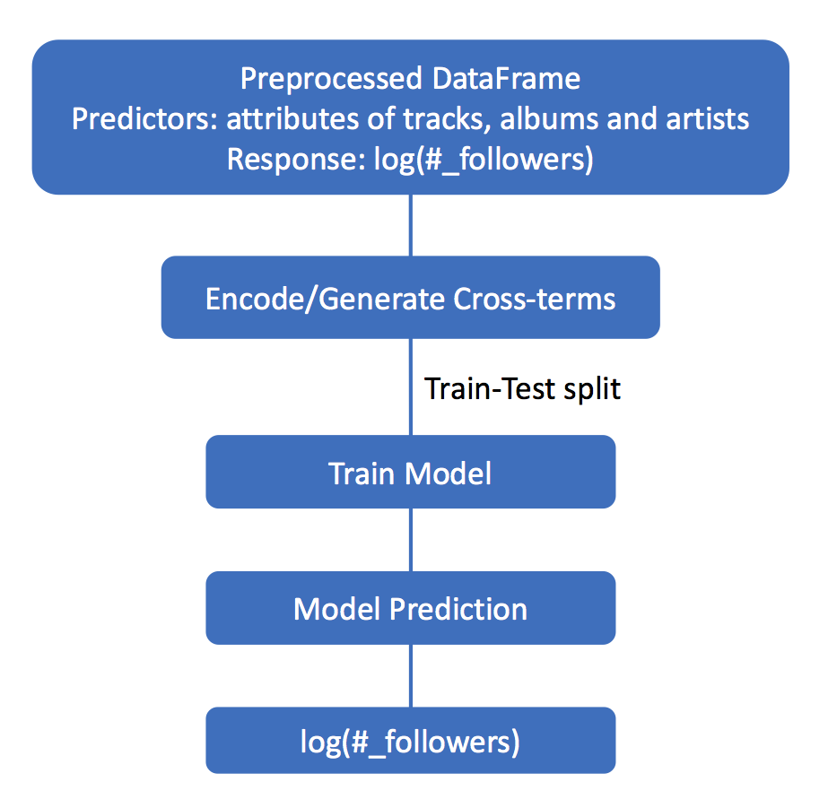
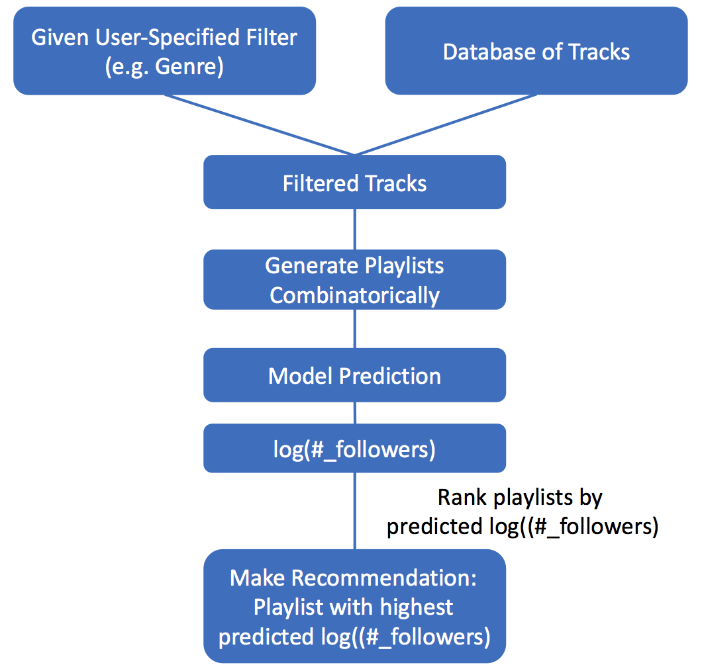

## Contents
{:.no_toc}
*  
{: toc}

## Team Group30
AC209a Final Project Group 30: Michelle Ho, Yijun Shen, Boyuan Sun, Jiawen Tong

## Problem Statement & Motivation 

One of the main goals of music streaming platforms like Spotify is to generate meaningful recommendations that might interest its users based on user-specified input or eventually collaborative filtering. This is an important task to retain and to gain active users. In order to do so, an approach is to recommend a collection of songs that is likely to be popular and followed by a large number of audience. In this way, we assume that a typical user is most likely to be interested in the recommended playlist if it has a high predicted number of followers. Therefore, the high-level goals of this Spotify project are:

- Formulate a model to predict the popularity of a Spotify playlist (as measured by the number of followers)
- Given user-specified genre and desired length of playlist (number of tracks), recommend a new playlist of combinatorially generated tracks with the highest predicted popularity (number of followers)

## Introduction & Description of Data
Ability to give appealing recommendations is key to retaining/gaining active users and improving revenue for most online businesses. Music streaming platforms are no exception. Here, we aim to build a music recommender system using data from one of the biggest music streaming platforms, Spotify, which made its data publicly available through its API. The main challenges of this project include: 1) downloading data is a rate limiting step because there is a wealth of data; 2) it takes some time to get familiar with using the API and its associated python library, Spotipy; 3) data is noisy; 4) data requires substantial feature engineering.

### Description of data

Data could be downloaded [here](https://drive.google.com/drive/folders/1LPETeTOLaUYCVstBU0WO4Fgc4ImvMkuP?usp=sharing).

The data attributes we obtained from **Spotify API** is given below:

- Playlist-level attributes:    

  - Playlist ID    
  - Owner ID    
  - Whether playlist is collaborative    
  - Number of tracks    
  - Track IDs    
  - Number of follower    

- Track-level attributes:    

  - Track name    
  - Track ID   
  - Track ISRC ID    
  - Artist names    
  - Artist IDs   
  - Artist genres  
  - Artist popularities    
  - Artist number of followers    
  - Album name    
  - Album ID   
  - Album popularity    
  - Audio features (danceability, energy, key, loudness, mode, speechiness, acousticness, instrumentalness, liveness, valence, tempo, duration, time signature)    
  - Whether lyrics is explicit    
  - Number of available markets   
  - Popularity

The data attributes we obtained from **Worldwide Daily Song Ranking** is given below:

- Position (Ranking)
- Track ID

## Related Resources 
To make more informed queries to the Spotify API, we consulted the following websites for trending playlist names: [Sportify trending playlist words 2015](https://insights.spotify.com/us/2015/12/18/trending-playlist-words-2015/), [DigitalTrends.com best Spotify playlists](https://www.digitaltrends.com/music/best-playlists-on-spotify/2/), and [gizmodo.com 25 most popular Spotify playlists](https://gizmodo.com/these-are-the-25-most-popular-spotify-playlists-510275721).

We used the [Spotipy python library](https://spotipy.readthedocs.io/en/latest/) as our tool to work with [Spotify web API](https://developer.spotify.com/web-api/).

## Modeling Approach
Our approach is consisted of 5 stages: 1) data collection; 2) data preprocessing; 3) exploratory data analysis; 4) predictive model building; 5) recommender system inception.
### Data collection
To collect Spotify data, we used **150 predefined words** and **50 randomly generated words** to query the Spotify API and saved a list of over **9,000 playlists** with corresponding track IDs in `playlists.json`. Using the set of track IDs in our playlists, we scraped the Spotify API again to extract tracks, and we stored a dictionary of around **270,000 tracks** with track IDs as keys and track related attributes as values (e.g, popularity, album name, danceability, and etc.). This dictionary is then saved as `tracks.json`. These two `.json` files, `playlists.json` and `tracks.json`, serve as our [databases](https://drive.google.com/drive/folders/1LPETeTOLaUYCVstBU0WO4Fgc4ImvMkuP?usp=sharing). 

For the additional dataset, we downloaded form Kaggle - [200 daily most streamed Spotify songs](https://www.kaggle.com/edumucelli/spotifys-worldwide-daily-song-ranking).

### Data preprocessing
For Spotify data, we first extracted track features for each playlist and performed feature engineering to build a dataframe, in which a row is a playlist and a column is an associated feature. For each playlist, there are playlist-level features, and track-level features. We chose to calculate the **average and standard deviation**, and for track-level categorical variables, we chose to take the **mode and count the number of unique** occurrences. Since Spotify playlists/tracks are not directly labeled with genre, we defined the **genre of a playlist** to be the most frequently occurring artist genre among all its tracks. We later realized that **Spotify defined over 2000 genres**, and many of them share similar names. Therefore, we decided to narrow down to **27 genres** by string matching. 

For the additional dataset, we engineered an additional field, **`score`** based on the rank of a song each time it made the top 200 most streamed list worldwide. Our definition is **`Score`** = (201 - rank_1) + … + (201 - rank_N), where N is the number of times the song made the top 200 list. We then appended the ranking scores to Spotify playlist dataframe by matching track IDs. 

See the diagram below for a visualization of our workflow.

### Model building & validation
Using our model building process depicted in the diagram below, we explored 16 different models and compared their performance based on their test $R^2$ scores. The models were built by:
- Using 2 sets of features:     
  - Main predictors     
  - Main predictors and interaction terms of (genre interacting averages of numeric audio features)
- Fitting 2 sets of **single** regression models for each set of feature       
  - Linear Regression       
  - Perform PCA on the main predictors and interaction terms       
  - RidgeCV       
  - LassoCV      
  - Random Forest Regressor      
  - Adaboost Regressor
- Training meta-models by **Stacking** all fitted models on the training set together to fit a    
  - **Meta regressor 1**: Average each single model's predicted value weighted by its accuracy on the validation set    
  - **Meta regressor 2**: Fit a linear regression model on the single models' predicted values on the validation set
    
 

**Note of the additional 209 method**: In addition to the regression models discussed in class, we implemented 2 unqiue meta regressors which combined the prediction results of all single models by either weighted averaging or fitting an additional linear regressor on the single models' prediction outputs. The meta linear regressor is proved to give the best performance among all models. 

### Recommender system & validation

Our recommender system allows the user to input the desired genre and length of playlist (i.e. number of tracks). Based on these inputs, we obtain all tracks belonging to the specified genre from our tracks database. To further limit our search space for shortening the time to generate a recommendation, our recommender system only considers the top **N+2** most popular tracks, where N is the number of desired tracks in the playlist. The recommender system then combinatorially generates **N+2 choose N** different playlists as recommendation candidates. Running these candidates through our predictive model, we obtain a predicted number of followers for each candidate. The recommender system finally recommends the playlist with the highest predicted number of followers. 

See diagram below for our workflow.

 

To validate our recommendation, our strategy is to find the **most similar** playlist within the user-specified genre from the playlists database. We define **Similarity** as  

$$ \text{set(tracks in recommended playlist)}   \cap \text{ set(tracks in existing within-genre playlist)}$$

The ranking of this most similar playlist within its genre based on its number of followers is an indication of how good our recommendation is.

## Results
### Predictive model 
Out of all the **single models**, **Random Forest Regressor** performed the best, but overall, the **Stacked Meta Linear Regression model** had the best predictive power. We did not find major differences in test scores between the 2 sets of features (main predictors only vs. main predictors + interaction terms between genre and audio features. The interaction terms between genre and average of numerical audio features slightly improved test scores for the **RidgeCV, LassoCV and weighted average meta model** but not for the other models. This suggests that some of the interaction terms are useful while others are not. Thus, the models fitted on main predictors and interaction terms are (to some extent) overfitted.

| Model                    | Main Only | Main & Interaction |
| ------------------------ | --------- | ------------------ |
| Linear Regression        | 0.25215   | 0.24658            |
| PCA                      | N/A       | (n=188) 0.20381    |
| RidgeCV                  | 0.25052   | 0.25243            |
| LassoCV                  | 0.24915   | 0.26894            |
| Random Forest            | 0.48157   | 0.47592            |
| Adaboost                 | 0.41946   | 0.41286            |
| Meta - Weighted Avg      | 0.41066   | 0.41578            |
| Meta - Linear Regression | 0.49653   | 0.49444            |

### Predictive model with additional dataset

- Incorporating the additional dataset **improved** test $R^2$ scores of **Linear Regression model, RidgeCV, LassoCV** on both sets of features.     

- 5-fold cross-validation of **PCA** on main predictors and the interaction terms selected out one more component (189) than before (188). This suggests the additional dataset did provide some useful information for better prediction.    

- Test $R^2$ scores of the ensemble regressors (random forest and adaboost; and stacking meta models as a result) did not improve with feature from the extra dataset. This may be because the ensemble models' training process include random predictors selection and boostrapping, which already gained enough useful information without the additional dataset. Adding more predictors unnecessarily increased these models' complexity.

  | Model                    | Main Only | Main & Interaction |
  | ------------------------ | --------- | ------------------ |
  | Linear Regression        | 0.25624   | 0.24970            |
  | PCA                      | N/A       | (n=189) 0.20661    |
  | RidgeCV                  | 0.25464   | 0.25436            |
  | LassoCV                  | 0.25393   | 0.27189            |
  | Random Forest            | 0.47226   | 0.46527            |
  | Adaboost                 | 0.41227   | 0.40371            |
  | Meta - Weighted Avg      | 0.40447   | 0.40797            |
  | Meta - Linear Regression | 0.48533   | 0.48341            |

### Recommender system
We tested our recommender system with several exmple user inputs. We summarize 3 such examples below. For more examples, please see the [recommendation](https://ac209a-project-spotify.github.io/group30/Recommendation.html) page.

- **Example 1**: Input genre = 'pop'; input # of tracks = 12

  - *The recommended playlist*

    | Artist names               | Track ID               | Track name                  |
    | -------------------------- | ---------------------- | --------------------------- |
    | Camila Cabello, Young Thug | 0ofbQMrRDsUaVKq2mGLEAb | Havana                      |
    | ZAYN, Sia                  | 1j4kHkkpqZRBwE0A4CN4Yv | Dusk Till Dawn - Radio Edit |
    | Ed Sheeran                 | 0tgVpDi06FyKpA1z0VMD4v | Perfect                     |
    | Dua Lipa                   | 2ekn2ttSfGqwhhate0LSR0 | New Rules                   |
    | Charlie Puth               | 32DGGj6KlNuBr6WaqRxpxi | How Long                    |
    | Selena Gomez, Marshmello   | 7EmGUiUaOSGDnUUQUDrOXC | Wolves                      |
    | Becky G, Bad Bunny         | 7JNh1cfm0eXjqFVOzKLyau | Mayores                     |
    | Sam Smith                  | 1mXVgsBdtIVeCLJnSnmtdV | Too Good At Goodbyes        |
    | Charlie Puth               | 4iLqG9SeJSnt0cSPICSjxv | Attention                   |
    | Maroon 5, SZA              | 3hBBKuWJfxlIlnd9QFoC8k | What Lovers Do (feat. SZA)  |
    | Lauv                       | 1wjzFQodRWrPcQ0AnYnvQ9 | I Like Me Better            |
    | Justin Bieber, BloodPop®   | 7nZmah2llfvLDiUjm0kiyz | Friends (with BloodPop®)    |

    ​

  - *The predicted number of follower* : 17795.27856902531

  - *The ranking of the most similar playlist in genre pop* : 23/2738

- **Example 2**: Input genre = 'rock'; input # of tracks = 10

  - *The recommended playlist*

    | Arist names       | Track ID               | Track name                               |
    | ----------------- | ---------------------- | ---------------------------------------- |
    | Imagine Dragons   | 5VnDkUNyX6u5Sk0yZiP8XB | Thunder                                  |
    | Imagine Dragons   | 0CcQNd8CINkwQfe1RDtGV6 | Believer                                 |
    | Imagine Dragons   | 4IWAyPf1KMq7JCyGeCjTeH | Whatever It Takes                        |
    | Twenty One Pilots | 3CRDbSIZ4r5MsZ0YwxuEkn | Stressed Out                             |
    | Eurythmics        | 1TfqLAPs4K3s2rJMoCokcS | Sweet Dreams (Are Made of This) - Remastered |
    | a-ha              | 2WfaOiMkCvy7F5fcp2zZ8L | Take On Me                               |
    | Twenty One Pilots | 6i0V12jOa3mr6uu4WYhUBr | Heathens                                 |
    | Twenty One Pilots | 2Z8WuEywRWYTKe1NybPQEW | Ride                                     |
    | AC/DC             | 2zYzyRzz6pRmhPzyfMEC8s | Highway to Hell                          |
    | Eagles            | 40riOy7x9W7GXjyGp4pjAv | Hotel California - Remastered            |

    ​

  - *The predicted number of follower* : 10451.662075669927

  - *The ranking of the most similar playlist in genre pop* : 804/981

- **Example 3**: Input genre = 'funk'; input # of tracks = 6

  - *The recommended playlist*

    | Artist names                         | Track ID               | Track name             |
    | ------------------------------------ | ---------------------- | ---------------------- |
    | MC Jhowzinho e MC Kadinho            | 0pDaqgIForVNO4jrtTxcWT | Agora Vai Sentar       |
    | 1Kilo, Baviera, Pablo Martins, Knust | 2srL4DYBekshpbprS6H0mO | Deixe Me Ir - Acústico |
    | Mc Livinho                           | 6pSYjx66rlqRmGGTHhnjCo | Fazer Falta            |
    | MC Kevinho, Leo Santana              | 7yYOMPwpV5CsK0cxoAZT6B | Encaixa                |
    | MC G15                               | 4BjPsq3MXBNo4Qxg40igEr | Cara Bacana            |
    | Mc Don Juan                          | 1kNVJQEkobOlyfbctPZ4fs | Amar Amei              |

  - *The predicted number of follower* : 75942.19733322992

  - *The ranking of the most similar playlist in genre pop* : 1/66

We found the performance of our recommender system varies significantly (i.e. the within genre ranking of the most similar playlist is fairly unstable) as shown in the 3 examples above. This variance could be due to 1) the model predicting the number of followers does not have sufficient predictive power or 2) our metric of similarity is not sufficient to actually find a very similar playlist in the existing pool of playlists. We suspect both reasons contributed to the variance in performance we observed. In the next section, we discuss some potential future directions to improve our recommender system performance.

## Conclusion & Future Work

We have successfully built a regression model to predict the number of followers of a playlist with reasonable out-of-sample $R^2$ scores (**Stacked Meta Linear Regression model**  with a test $R^2$ score of 0.49653 with main predictors only and that of 0.49444 with main predictors + interaction terms between genre and audio features). We have also built a recommendation system based on user-specified inputs and our stacked meta linear regression model with main predictors and interaction terms. 

We found that the performance of the recommender system varies greatly for different user inputs. One possible reason is because most of the playlists collected are of the genre “pop”. To mitigate this problem, we could consider collecting more balanced number of playlists/tracks among all genres or consider a better categorization of playlist genres (Note: due to a lack of data labeling, we used most frequently occurring artist genre as playlist genre). Another possible reason for the variance in recommender system performance is the fact that we filtered track candidates based on popularity when popularity only weakly associates with number of followers (see EDA). To improve the performance of the recommendation, we consider future work to be optimizing our candidate generation process: 1) gather more balanced number of playlists/tracks among all genres 2) use audio feature to better define 'similarity'.